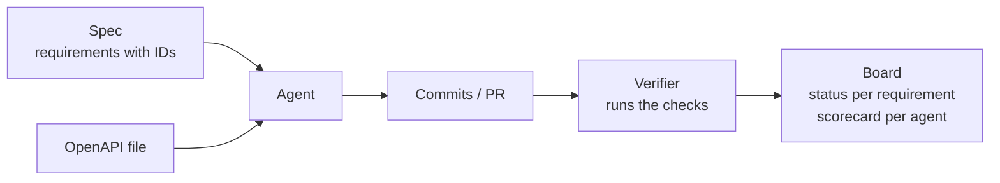

# Agent Quality Verifier

A guide to checking an agent's work against the spec without reading its code.

Status: design guide, Oct 2, 2026. Nothing here is built yet beyond the Python
prototype (`trace.py`). Language support marked *expected* still needs the
multi-language runs described at the end.

## What it is

Agents write more code than people can review. The verifier replaces line-by-line
review with checks that anyone can rerun. Each requirement in the spec gets a
status, and each agent gets a scorecard. A developer or product owner looks at
those, and opens the code only when a check fails.

"Quality" here means the agent followed the engineering practices you would
expect from a good engineer:

1. **Tests prove the spec.** Every requirement has tests tagged to it, the tests
   run the requirement's code, and they pass.
2. **The API matches its OpenAPI contract.** The spec says which requirements are
   API requirements. The agent writes or updates the OpenAPI file to cover them,
   and the running service must match that file.
3. **Git history follows standard conventions.** Commits, branches and merges
   follow widely adopted rules, so every change can be traced to a requirement
   and to the agent that made it.

## The rule for every check

A check is only allowed in the verifier if all three are true:

- **Repeatable:** the same commit and the same config always give the same result.
- **Defined in advance:** the pass/fail rule is written down before it runs.
- **Rerunnable by anyone:** a developer can run it locally and get the same answer.

This rules out LLM judges, "readability" scores and any opinion-based review.
Those can still help a human, but they never affect a status or a scorecard.

## How it works



1. A person writes the requirements. Each one has a stable ID.
2. The agent updates the OpenAPI file for API requirements, writes code and tests,
   and commits following the git conventions.
3. The verifier runs locally and in CI. It produces one result per check per
   requirement, tied to the exact commit and the exact wording of the requirement.
4. The board shows the results. A PR fails if any requirement's status gets worse.

## Conventions the agent must follow

### Requirements (spec files)

One requirement per line. API requirements name their operations.

```markdown
- **AC-auth-001** (api: POST /login): Users sign in with email and password.
- **AC-auth-002** (api: POST /login): Accounts lock after 3 consecutive failed attempts.
- **AC-auth-003**: Sessions expire after 30 minutes of inactivity.
```

- IDs are `AC-<area>-<nnn>`, never reused and never renumbered. A registry file
  (`specs/.ids`) records every ID ever issued.
- `(api: METHOD /path)` marks an API requirement. List several operations with commas.
- Changing any part of the line resets that requirement's results to **Stale**
  until the checks run again.

### OpenAPI file

- Contract first: the agent updates `openapi.yaml` before or with the code, in the
  same PR. Reviewers approve contract changes the way they approve spec changes.
- Every operation lists the requirements it serves: `x-requirements: [AC-auth-001]`.
  (The prototype calls this `x-clauses`.)
- Every response the requirement needs is documented with a schema, and object
  schemas use `additionalProperties: false` so extra fields are caught.

### Tests

Put the requirement ID in the test name. Tags and annotations usually don't reach
the test report, but names always do. Matching ignores case and treats `-`, `_`
and spaces the same.

| Language | Example test name |
|---|---|
| Python | `def test_AC_auth_002_lockout():` |
| JavaScript / TypeScript | `test("AC-auth-002 locks after 3 failed attempts", …)` |
| Go | `func TestAC_auth_002_Lockout(t *testing.T)` |
| Rust | `fn ac_auth_002_lockout()` |
| Kotlin | ``fun `AC-auth-002 locks after 3 failed attempts`()`` |

### Git

| Convention | Example |
|---|---|
| [Conventional Commits](https://www.conventionalcommits.org/) subject | `feat(auth): lock account after 3 failed attempts` |
| Requirement as a git trailer on every commit that changes code | `Refs: AC-auth-002` |
| One requirement per code commit | Split the commit instead of citing two IDs |
| Agent named in a trailer | `Co-Authored-By: <agent name>` |
| Branch name | `feat/AC-auth-002-lockout` |
| Merge with a merge commit or rebase, not squash | Squashing removes the commits the checks point to |
| Never rewrite the main branch | No force-push to `main` |

## How far each check reaches

Some checks work in every repo. Others need something from the project's tools.
The letter on each check says what it needs.

| Reach | Needs | Target |
|---|---|---|
| **G** | Any git repo | Every repo and language. No setup. |
| **C** | The conventions above | Every repo and language once the conventions are followed. |
| **S** | Standard tool output: JUnit XML, LCOV or JaCoCo coverage, OpenAPI | Every language through a small runner profile. Most setup effort goes here, and it is where most of the value is. |
| **E** | A per-language tool (for example a mutation tester) | Offered where the tool exists. Where it doesn't, the board shows **Not covered** and what the check would catch. |
| **F** | An adapter for one framework | Same as E: shown as **Not covered** until an adapter exists. |

A check that can't run reports **Not covered**. It never reports a pass.

## The checks

Each check lists what it guarantees when it passes, and what it does not.

### 1. Tests prove the spec

| ID | Check | Reach | Guarantees | Does not guarantee |
|---|---|---|---|---|
| T1 | Requirement IDs are valid and never reused | C | Every requirement can be referenced, and a reference always means the same requirement. | That the requirement is clear or testable. |
| T2 | A commit that changes code references the requirement | C | Someone claimed to implement it, in a specific commit. | That the code exists today. |
| T3 | The code from those commits still exists | G | The claimed implementation is still in the repo (via `git blame`, ignoring blank and comment lines). | That the code is correct. |
| T4 | Tests are tagged to the requirement | C | At least one test says it covers the requirement. | That the test checks anything. |
| T5 | The tagged tests pass | S | Those tests pass on this commit. A suite that fails to load shows as an error, not as "no tests". | That the tests run the requirement's code. |
| T6 | The tagged tests run the requirement's code | S | The tests execute the lines written for this requirement. Import-time execution doesn't count. | That the tests assert the right thing. |
| T7 | The tagged tests fail when the code is broken | E | Changing the requirement's lines (mutation testing) makes its tests fail, so the assertions matter. | Behavior the requirement never stated. |
| T8 | Results reset when the requirement changes | G | No result shows as current after the requirement's wording changed. | That the new wording is implemented. Rerunning the checks decides that. |

How T6 works in any language: run only the requirement's tagged tests (every test
runner can filter by name) and collect coverage. Then run with no tests selected
and subtract those lines, which removes code that runs just by loading the project.

### 2. The API matches its OpenAPI contract

| ID | Check | Reach | Guarantees | Does not guarantee |
|---|---|---|---|---|
| A1 | Every API requirement has an operation that references it | C | The contract covers every API requirement in the spec. | That the operation is implemented. |
| A2 | Every operation references a requirement | C | The contract has no endpoints the spec doesn't explain. | Anything about the code. |
| A3 | The contract passes the lint rules | S | Valid OpenAPI, plus house rules: every response documented with a schema, `additionalProperties: false`, error responses defined (Spectral or Redocly). | That the service follows it. |
| A4 | No breaking change unless the spec changed | S | A PR can't break API consumers unless a requirement changed in the same PR (oasdiff against the base branch). | That non-breaking changes are wanted. |
| A5 | The service serves exactly the documented routes | S or F | No hidden endpoints and no missing operations. Uses OpenAPI generated from the code, or compile-time checks with contract-first code generation. Otherwise needs a route-listing adapter. | That responses are correct. |
| A6 | Responses in the tagged tests match the contract | F | Every status code and response body seen in the requirement's tests is documented, with no extra fields. | Responses the tests never triggered. |
| A7 | The running service conforms to the contract | S | Generated requests across every operation get documented responses (Schemathesis with a fixed seed). Doesn't depend on the agent's own tests. | Which requirement a failure belongs to. |

A6 and A7 complement each other. A6 ties a result to a requirement but needs an
adapter per framework. A7 works in every language but can't say which requirement
broke.

### 3. Git history follows the conventions

| ID | Check | Reach | Guarantees |
|---|---|---|---|
| H1 | Commit subjects follow Conventional Commits | C | Every change states its type (`feat`, `fix`, `refactor`, `test`, `docs`, `chore`) and a subject. Changelogs and version bumps can be generated. |
| H2 | Commits that change code carry a `Refs:` trailer | C | Every code change is traceable to a requirement, or is explicitly marked as serving none. |
| H3 | One requirement per code commit | C | Test and coverage credit can't be shared between requirements. |
| H4 | `refactor` and `chore` commits change no requirement's status | G + S | Commits that claim to change no behavior really don't, measured by rerunning the checks. |
| H5 | Commit size stays under the configured limit | G | Changes come in reviewable units. Lockfiles and generated files are excluded. |
| H6 | Branch names follow the pattern | C | Work in progress is traceable to a requirement before it merges. |
| H7 | The main branch is never rewritten | G | The last verified `main` commit is still in history, so no result points to a vanished commit. |
| H8 | The agent is named on its commits | C | Agent and human work can be told apart, which the scorecard needs. |
| H9 | Commits are signed (optional) | G | The author identity is verified (`git verify-commit`). |

## What the checks catch

Attacks from the prototype demo and `PLAN.md`, plus two the checks are designed
for. In every case the test suite stayed green, or failed without saying why.

| Attack | Caught by |
|---|---|
| Spec changes from 5 attempts to 3, code untouched | T8 |
| Commit cites a requirement but only adds a comment | T3 |
| Test named for a requirement does `assert True` | T6 |
| Test runs the code but asserts nothing useful | T7 |
| Unrelated commit deletes a requirement's code | T3, H4 |
| Login response leaks a `debug_password` field | A6 |
| Lockout switches to HTTP 423, test updated to match | A6 (A4 if the contract was changed too) |
| `GET /debug/users` ships | A5 |
| Test suite fails to import | T5 reports an error |
| Agent cites two requirements in one commit | H3 |

## Requirement status

Each requirement shows one status. A requirement reaches a status only when every
check below it passes.

| Status | Means | Checks |
|---|---|---|
| Not started | No commit references it | T2 fails |
| Claimed | A commit references it, but its code isn't in the repo | T2 passes, T3 fails |
| Built | Its code exists | T3 passes |
| Tested | Its tagged tests run its code and pass | T4, T5, T6 pass |
| Verified | Tested, and for API requirements the contract checks pass | A1, A5, A6 or A7 pass; T7 too when enabled |
| Stale | The requirement changed after the last run | T8 |
| Failing | A check that previously passed now fails | Shows which check |

Checks that are **Not covered** for the project's stack are listed next to the
status, so a Verified requirement says what it was verified *without*.

## The agent scorecard

Every number comes from check results and git history. Nothing is a judgment call.

| Measure | From |
|---|---|
| Requirements taken to Verified | Requirement status |
| Pushes needed to reach green per PR | Check results per commit |
| Status regressions blocked | PRs failing because a status got worse |
| Contract violations introduced | A3–A7 failures on the agent's commits |
| Git convention pass rate | H1–H8 |
| Protected files changed (spec, OpenAPI, verifier config) without approval | Git diff on protected paths |

## Language support

The prototype covers Python with FastAPI only. The table shows what each check
needs in the six languages agents use most. These entries are **expected**; the
runs below will confirm them.

- **Ready:** works with standard tools.
- **Tool:** needs one extra, widely used tool installed.
- **Adapter:** needs a small adapter we write.
- **Partial:** works with known limits.

| Check | Python | JavaScript | TypeScript | Go | Rust | Kotlin |
|---|---|---|---|---|---|---|
| Framework used in the runs | FastAPI | Express | Fastify | net/http + oapi-codegen | axum | Spring Boot |
| T1–T4, T8, H1–H9 | Ready | Ready | Ready | Ready | Ready | Ready |
| T5 tests pass (JUnit XML) | Ready: `pytest --junitxml` | Ready: `node --test --test-reporter=junit` | Ready: Vitest `--reporter=junit` | Tool: gotestsum | Tool: cargo-nextest | Ready: Gradle |
| T6 tests run the code (coverage) | Ready: coverage.py | Ready: Node coverage, LCOV | Ready: Vitest v8, LCOV | Tool: `go test -coverprofile`, converted | Tool: cargo-llvm-cov | Ready: Kover or JaCoCo XML |
| T7 mutation testing | Tool: mutmut | Tool: Stryker | Tool: Stryker | Tool: gremlins | Tool: cargo-mutants | Partial: PIT, limited Kotlin support |
| A1–A4 contract checks | Ready | Ready | Ready | Ready | Ready | Ready |
| A5 served routes | Ready: generated OpenAPI | Adapter: route listing | Ready: @fastify/swagger | Ready: compile-time via oapi-codegen | Adapter: route listing (utoipa covers annotated routes only) | Ready: springdoc |
| A6 responses in tagged tests | Ready: prototype adapter | Adapter: supertest | Adapter: `fastify.inject` | Adapter: httptest | Adapter: tower `oneshot` | Adapter: MockMvc |
| A7 running service conforms | Ready | Ready | Ready | Ready | Ready | Ready |

Two patterns stand out. Every G and C check works everywhere with no setup. The
gaps are A5 and A6, and contract-first code generation (Go with oapi-codegen, or
openapi-generator for Kotlin) closes A5 at compile time instead of needing an adapter.

### Runner profile

The only per-project setup. It tells the verifier how to run the tests and where
the reports go.

```yaml
# Vitest example
test:     npx vitest run -t "{filter}" --reporter=junit --outputFile={junit}
coverage: --coverage.enabled --coverage.reporter=lcov --coverage.reportsDirectory={coverage}
formats:  { results: junit, coverage: lcov }
```

```yaml
# Go example
test:     gotestsum --junitfile {junit} -- ./... -run '{filter}' -coverprofile={coverage}/cover.out
formats:  { results: junit, coverage: gocover }
```

### Plan for the multi-language runs

1. Use the same spec (the auth service: sign-in, lockout, locked error, session
   expiry, password reset, non-revealing reset response) and the same
   `openapi.yaml` in all six languages.
2. Have an agent build the service in each language with the framework above,
   following the conventions.
3. Write a runner profile per language.
4. Run every check on the finished service, then replay every attack in
   [What the checks catch](#what-the-checks-catch).
5. Replace the *expected* entries in the table with measured results.

Done when:

- G and C checks work in all six languages with no adapter.
- S checks work in all six languages with only a runner profile.
- Every attack is caught in every language, or the board shows **Not covered**
  and names the adapter that would catch it.

Toolchains for Python, Node, Bun, Go, Rust, Java and Gradle are already installed
in this environment. Kotlin builds through Gradle.

### Languages to add later

- **Java:** same tools as Kotlin (Gradle or Maven, JaCoCo, PIT, springdoc).
- **C#:** `dotnet test` with a JUnit logger, coverlet, Stryker.NET, Swashbuckle.
- **Ruby:** RSpec with rspec_junit_formatter, SimpleCov, mutant, rswag.

## Later candidates

These are objective and fit the same model. They are not part of the three goals yet.

- Formatter, linter and type checker report zero errors with the project's config.
- No secrets committed (gitleaks).
- No dependencies with known vulnerabilities (OSV-Scanner).

## How it fits with specloop

- **Verifier:** a separate package that runs the checks next to the code, locally
  and in CI.
- **specloop:** owns the spec and reports process events (decisions, run state,
  task changes). Checking a box in specloop is a claim, never a pass.
- **Board service:** receives results from the verifier and events from specloop,
  and shows the board and scorecards, locally or hosted.

## Open decisions

- Squash merges: forbid them, or read each PR's commit list from the forge instead.
- Requirement reference: `Refs:` trailer only, or also `[AC-…]` in the subject as
  the prototype does.
- Mutation testing (T7): block merges, or show it on the board only.
- Contract-first code generation versus OpenAPI generated from code, per language.
